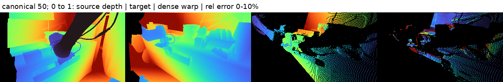
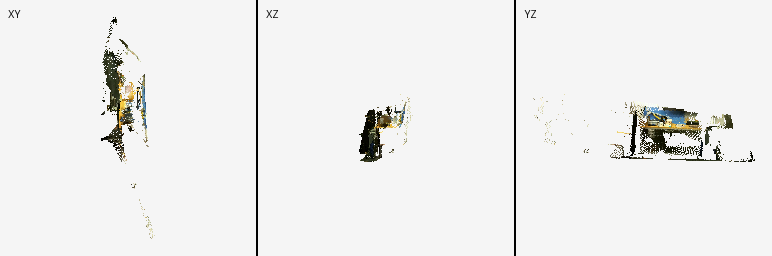
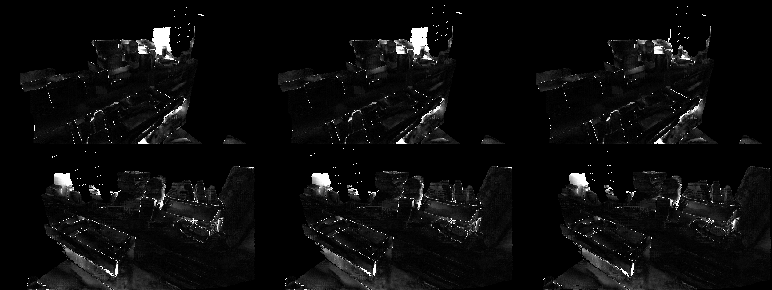

# Results

Final numbers only; each links to its run. Thresholds are never relaxed. Process notes: `docs/EXPERIMENT_LOG.md`.

## Meta-World campaign (2026-10-07 onward)

### Phase A — runtime (R1)
| Check | Result | Evidence |
|---|---|---|
| Standalone environment, gsplat/fused-ssim built for sm_120 | pass | `docs/runtime_versions.json` |
| Native rasterization, GPU 4 and GPU 5 | pass (finite; gradients for all attributes) | `docs/native_render/*.json` |
| Full test suite | 199 passed, 0 failed, 0 errors, 0 skipped | `docs/tests.json` |
| GPU isolation (CUDA and EGL per UUID) | pass | `docs/gpu_isolation.json` |
| 50-step rendered training, GPU 4 then GPU 5 | pass (finite losses, nonzero gradients) | `outputs/smoke50-gpu4`, `outputs/smoke50-gpu5` |

### Phase B — data (D1-D3)
| Task | Size | Train / val episodes | D2 median (<= 3 mm) | D3 median (<= 5 mm) | Evidence |
|---|---|---|---|---|---|
| door-open | 15.6 GB | 240 / 10 | 0.91 mm | 1.97 mm | `docs/data_checks/door-open/` |
| hammer | 19.9 GB | 240 / 10 | 1.00 mm | 1.97 mm | `docs/data_checks/hammer/` |
| peg-unplug-side | 23.2 GB | 240 / 10 | 0.90 mm | 1.97 mm | `docs/data_checks/peg-unplug-side/` |
| stick-push | 20.8 GB | 240 / 10 | 0.98 mm | 1.99 mm | `docs/data_checks/stick-push/` |
| pick-place | 17.3 GB | 240 / 10 | 0.89 mm | 1.91 mm | `docs/data_checks/pick-place/` |
| peg-insert-side | 22.6 GB | 240 / 10 | 0.86 mm | 2.00 mm | `docs/data_checks/peg-insert-side/` |
| shelf-place | 22.2 GB | 240 / 10 | 0.89 mm | 1.98 mm | `docs/data_checks/shelf-place/` |
| bin-picking | 20.7 GB | 240 / 10 | 0.88 mm | 2.04 mm | `docs/data_checks/bin-picking/` |

World-body motion is exactly zero on every task. Data: `/home/ws/data/metaworld/splatter4d_v1/`.

### M2 — overfit gate (FAIL after three diagnosed iterations)
Hammer episode ep001, one episode, evaluated on the same episode; thresholds: train-view PSNR >= 32 dB and moving
relative EPE (0->2) <= 0.15 within 3k steps.

| Iteration | Change (gate only) | Steps | PSNR s2 / s6 | Rel. EPE 0->2 s2 / s6 | Run |
|---|---|---|---|---|---|
| 1 | warm-up 300 (original 20k temporal ramp) | 3k | 23.9 / 24.1 | 0.79 / 0.51 | `runs/pretrain/gate-m2-hammer` |
| 2 | + ramp 300, constant LR | 3k | 24.5 / 24.4 | 0.69 / 0.54 | `runs/pretrain/gate-m2-hammer-it2` |
| 3a | + LR x4 (2e-3) | 3k | 25.5 / 25.1 | 0.79 / 0.60 | `runs/pretrain/gate-m2-hammer-it3a` |
| 3b | iteration 2 for 12k steps | 3k / 12k | 24.0 / 24.1 at 3k; 26.1 / 25.9 at 12k | 0.66 / 0.45 at 3k; 0.37 / 0.25 at 12k | `runs/pretrain/gate-m2-hammer-it3b` |

Evidence for the diagnosis: the Gaussian budget is not the limit — free Gaussians fitted directly to the same frame
reach 39.6 dB with the method's 8,192 Gaussians (`runs/diag/capacity-8192/capacity.json`). Neither the temporal
ramp, the LR floor nor the LR magnitude explains the gap, and four times the gate length still misses both
thresholds (PSNR +0.3 dB per 1k steps at 12k; relative EPE flattening at 0.25-0.37). The dynamic alpha share on
moving pixels reaches 0.88 (M7 threshold 0.7). Conclusion: with the specified decoder and loss weights the model
fits a single episode slowly; M2 is recorded as failed and the plan continues (full pretraining and the Stage 1
improvement loop).

### Completed development comparisons — not the frozen-method final comparison

#### S1 — synthetic-view variants (2026-10-10): neither qualifies

Two pretraining seeds (0/1) on each development task, evaluated with the full-split evaluator at 100k of the base
200k schedule and fixed episode split 0. The pre-registered fallback retains C: synthetic near views as invariance
positives and render targets. Evidence and reference-derived margins: `docs/decisions/s1_rule_2026-10-10.txt`.

| Configuration | Hammer dynamic share, seed 0 / 1 | Pick-place dynamic share, seed 0 / 1 | Pick-place relative EPE, two-seed mean |
|---|---|---|---|
| R = C | 0.884 / 0.170 | 0.062 / 0.074 | 1.0001 |
| V1 = synthetic invariance only | 0.825 / 0.183 | 0.718 / 0.017 | 0.9024 |
| V2 = C + self-render | 0.923 / 0.439 | 0.050 / 0.051 | 1.0000 |

Motion metrics above use stride 6, pair 0→2. V1 fails the required pick-place mean dynamic share >=0.5 (0.3676), and
its trajectory CD-render worsens by 47.4% on hammer and 31.4% on pick-place, beyond reference margins of 14.7% and
19.7%. Pick-place PSNR falls 0.423 dB, beyond the 0.2 dB margin. V2 fails to recover pick-place motion and reduces
moving-pixel PSNR by 0.347 dB, also beyond its 0.2 dB margin. Both fail the registered rule despite passing the
retrieval/probe no-regression guards.

**Limitation:** low dynamic contribution is seed-sensitive and is not confined to pick-place. The reference hammer
seeds differ by 0.714 in dynamic share and 0.313 in relative EPE. Improved retrieval does not establish successful
motion learning. No favorable seed rerun or margin change is used; items 1-2 continue under their registered rules.

#### Item 3 — loader benchmark (2026-10-09)

The chosen default is prefetch 2 x 6 workers: 9.61 GB maximum whole-process-tree PSS across two passes, versus
11.29 GB for reference 4 x 8. Its mean step time was 0.481 s versus 0.717 s, satisfying the registered +10% bound.
GPU contention changed between passes, so this is not evidence of a causal loader speedup. Raw measurements:
`runs/bench-loader-synth-hammer/bench.json`. RAM declarations are 13 GB for the new default and 15 GB for existing
4 x 8 jobs; the approximately 15% saving did not meet the 40% restart rule.

#### S4 context — DrM + CNN pick-place, seed 2000 (2026-10-10)

Run: `runs/s4-drm-cnn-pick-place-s2000/`, 1M agent steps, full evaluation protocol. Final success: training cameras
0.675, held-out cameras 0.000, trajectories 0.575. Last-5 means: 0.645 / 0.015 / 0.570, respectively. This establishes
that pick-place is solvable under the protocol, not that another representation must learn at the same rate.

**Caveat:** OOM-killed at 693k and resumed from the 650k checkpoint with the same seed. Evaluation records at
660k-690k come from the pre-incident branch; later evaluations, including the final endpoint, come from the resumed
branch. The curve is therefore mixed and must not be presented as uninterrupted training. The resumed branch used
MADV_RANDOM, an I/O hint that leaves replay contents and sampling unchanged. Stage-4 reuse is conditional on unchanged
code/protocol, and must retain this caveat.

---

# Earlier record: implementation phase (before this campaign)

## Results and acceptance record (implementation phase)

Updated 2026-10-07. **The requested research project is not complete.** Shared architecture, adapters, diagnostics and protocols are implemented. Real pilot geometry and DROID alignment passed. Actual Gaussian rendering is blocked by a PyTorch/native-extension binary mismatch. No rendered training, overfit, timing, research evaluation or trained export ran. Required deletion and exact reference preservation are also not verified.

## Acceptance, environment and safety

No threshold was relaxed. PASS below applies only to the named scope. BLOCKED means a required measurement or action did not run. PARTIAL never counts as full acceptance.

| Criterion | Status | Evidence and remaining requirement |
|---|---|---|
| R1: orphan history, all tests, Ruff | **PARTIAL** | Clean orphan branch delivery is recorded below. Ruff check/format pass. Full suite: 157 passed, 4 errors, 0 failed assertions, 0 skipped; exit 1. Native errors prevent the mandatory all-tests-pass gate. |
| R2: prescribed deletion and original DROID unchanged | **BLOCKED** | Obsolete cache remains. Required recursive open-file check unavailable; installation and destructive rewrite denied. No original before/after count/du proof. |
| R3: authorized writes and unchanged old repository statuses | **NOT VERIFIED** | Both reference HEADs and DROID reference status unchanged. Hierarchical reference status differs because a baseline untracked file is now absent. Cause unknown. |
| R4: CUDA/EGL isolation | **PASS for executed GPU work** | Both allowed UUIDs verified by live CUDA+EGL PID checks; guards precede GPU-aware imports. No other GPU selected. No actual two-rank NCCL research run exists. |
| D1: task success, required full data and saved splits | **PARTIAL** | All noise-free success and sampled visibility gates pass. Eight five-episode pilots contain required fields. Full 250-episode/task datasets and saved split manifests are missing. |
| D2: moving-point median discrepancy <=3 mm; world zero | **PASS on pilots** | Every pilot median passes; exact zero world-body motion. Full-data recheck missing. |
| D3: fusion median <=5 mm | **PASS on pilots** | Every pilot median passes. Full-data recheck missing. |
| M1: finite training, active fraction >10% | **BLOCKED** | Synthetic full-loss gradients pass, but actual losses, Gaussian activity and opacity collapse have not been measured. |
| M2: PSNR >=32 dB and moving relative EPE <=.15 by 3k | **BLOCKED** | No Meta-World rendered overfit. |
| M3: validation PSNR train >=28, moving >=25, held-out >=24, AbsRel <=.03, relative 02 EPE <=.35 | **BLOCKED** | No final per-task trained checkpoint. |
| M4: 64-distinct-episode retrieval train >=.95, held-out >=.85; K1 rank >=32 | **BLOCKED** | Protocol tested, but pilots have fewer than 64 episodes. No learned-state measurement. |
| M5: hand R2 >=.95, object >=.90, velocity >=.6 and >=.2 above T1 | **BLOCKED** | Probe functions tested, no trained states or T1 comparator. |
| M6: ablation directions on hammer and pick-place | **BLOCKED** | Required variants are configured but none trained. Unavailable directions reported below, not fabricated findings. |
| M7: dynamic alpha share >=.7 on score >.5 | **BLOCKED** | Correct all-time metric tested synthetically, not measured on a trained scene. |
| L1: real schema and license | **PASS** | Real pinned PointWorld episode, inspected files and complete NVIDIA dataset license. |
| L2: sample RLDS match >=95% | **PASS on selected sample** | Independently matched 1/1 selected episode. No corpus-wide rate claimed. |
| L3: dense reprojection <=3%, scene depth <=1 cm, gripper <=1.5 cm and moving overlays | **PASS on selected sample** | True dense selected median 1.5513%; unfiltered 2.2385%. Scene 0.7565 mm; disjoint-clip gripper 12.2071 mm. Actual overlays viewed. |
| L4: contract and throughput | **PASS on selected cache** | Both resolutions and all 35 windows validated with zero and two workers. Throughput below. |
| L5: both-backbone 2k overfit PSNR >=28, motion reduction >=80% | **BLOCKED** | Both encoders and pretrained DINO weights verified; no rendered overfit. |
| L6: 300-step smoke, 50-step NCCL smoke, global step-0 equality <=1e-4 | **BLOCKED** | Deterministic rendered-comparison protocol implemented/tested, never run natively. CPU/Gloo equality does not satisfy L6. |

### Exact environment

Current venv uses `reference_runtime.pth` to read already installed reference packages. It does not modify the reference environment, but it is **not a standalone successful uv installation**. Safe lock resolution completed for 144 packages without native builds. Source revisions remain pinned in `pyproject.toml`/`uv.lock`. Versions are recorded in [runtime_versions.json](runtime_versions.json).

| Component | Used version |
|---|---|
| Python | 3.10 |
| PyTorch / torchvision | 2.10.0+cu129 / 0.25.0+cu129 |
| gsplat / fused-SSIM | 1.5.3 / 1.0.0 |
| MuJoCo / Meta-World / gymnasium | 3.10.0 / 3.0.0 / 1.3.0 |
| NumPy / h5py / PyYAML | 1.26.4 / 3.16.0 / 6.0.3 |
| W&B / Pillow / setuptools | 0.25.0 / 11.3.0 / 82.0.1 |
| TensorFlow / TFDS | 2.18.1 / 4.9.10 |
| pytest / Ruff | 9.1.1 / 0.16.10 |
| GPU memory per allowed device | 97,887 MiB |
| Disk available at closeout | approximately 3.6 TB |

The actual CUDA fused-SSIM tests pass. Native Gaussian tests fail at setup with:

```text
ImportError: gsplat/csrc.so: undefined symbol:
_ZNK2at10TensorBase14const_data_ptrIaEEPKT_v
```

Three diagnosed precompiled compatibility alternatives were exhausted:

| Attempt | Existing binary/runtime | Diagnosed missing symbol |
|---|---|---|
| 1 | gsplat csrc with torch 2.10 | `_ZNK2at10TensorBase14const_data_ptrIaEEPKT_v` |
| 2 | Existing cached CUDA kernel with torch 2.10 | `_ZNK3c104cuda10CUDAStream5queryEv` |
| 3 | Existing csrc with alternate installed torch 2.13 | `_ZN5torch8autograd10deleteNodeEPNS0_4NodeE` |

No fourth workaround was pursued. New native source builds were denied. An earlier upstream initializer attempted auto-JIT but no build succeeded; the production wrapper now rejects missing/incompatible prebuilt binaries before importing that initializer. Tests retain real native errors rather than skipping or mocking them into acceptance. See [tests.log](tests.log), [tests.json](tests.json), [tests.junit.xml](tests.junit.xml), [lint.json](lint.json) and [ruff_final.log](ruff_final.log).

Synthetic tests verify contract/geometry, perfect/non-perfect loss gradients, dynamic grouping, masking, encoder-only export, complete loss wiring and local diagnostics. Real CPU/Gloo tests verify global InfoNCE loss and gradients, rank-zero evaluation synchronization/failure propagation, and per-rank RNG checkpoint restoration. These are not rendered training or NCCL acceptance. [exercise_evidence.json](exercise_evidence.json) maps every implementation module to tests or real pipeline evidence. Actual collection exercises the collection module that is absent from the parent unit-test trace.

### GPU, deletion, and preservation record

| UUID | Verified visible CUDA ordinal | Verified EGL device | Isolation |
|---|---:|---:|---|
| GPU-76871c16-ff1d-f7b1-cdf5-fabbaf9df8ce | 0 | 16 | PASS |
| GPU-d09f0338-71b9-d915-3c7f-e99754a3b639 | 0 | 17 | PASS |

[gpu_isolation.json](gpu_isolation.json) includes live process-table evidence, including graphics contexts. Both devices were idle at closeout. No inference about experiment throughput or safe co-location is made. No long jobs were launched.

Deletion target and protected root resolve to the exact distinct nonsymlink paths. The target still exists. Neither lsof nor fuser is available. Their installation and a destructive-script rewrite were denied. The entrypoint is now non-destructive and always aborts. No recursive removal ran. Required original DROID file count, exact du byte total, top-level listing and verified before/after equality were **not obtained**. Consequently no deletion or original-data invariance claim is made. [deletion_status.json](deletion_status.json) is the record, not proof of successful deletion.

Reference comparison begins at the first obtainable baseline on local 2026-10-07, not before the session. Both reference HEADs are unchanged. `droid_training` remains clean. `hierarchical_splatter` retains pre-existing modifications, but its baseline untracked `download_pointworld_all.py` is now absent. File absence was independently checked. The cause is unknown. No restoration or write to that repository was attempted. The copied MuJoCo helper is byte-identical. [reference_baseline.json](reference_baseline.json) and [reference_preservation.json](reference_preservation.json) expose the discrepancy. This is not exhaustive proof of all filesystem writes.

## Data measurements and completed validation runs

### Meta-World task gates and pilots

No tasks were replaced. Noise-free checks used twenty episodes per task. Success was measured every step. Visibility was sampled every ten simulation steps and passed the required four-of-six-camera support on every sampled episode. The first visibility attempt incorrectly selected non-rendered mocap bodies. Restricting to rendered non-robot geometry fixed that diagnosis; both attempt artifacts are retained.

| Task | Noise-free success | Pilot episodes | Pilot steps | File bytes | D2 median mm | D3 median mm |
|---|---:|---:|---:|---:|---:|---:|
| door-open | 100% | 5 | 591 | 188,198,621 | 0.970268 | 2.008431 |
| hammer | 100% | 5 | 1,278 | 456,138,215 | 0.960803 | 1.984998 |
| peg-unplug-side | 100% | 5 | 1,585 | 531,338,628 | 0.782149 | 1.990537 |
| stick-push | 100% | 5 | 1,572 | 552,761,254 | 0.870541 | 1.998317 |
| pick-place | 100% | 5 | 1,593 | 532,976,549 | 0.773322 | 1.917468 |
| peg-insert-side | 90% | 5 | 1,415 | 493,639,825 | 0.814494 | 1.990768 |
| shelf-place | 100% | 5 | 947 | 330,801,709 | 0.904705 | 1.962188 |
| bin-picking | 100% | 5 | 1,582 | 531,677,191 | 0.720736 | 2.039484 |

| Aggregate evidence | Value |
|---|---:|
| Retained moving-depth comparisons | 1,953,605 |
| Retained fused points | 3,045,899 |
| Tested world-body pixels | 941,478 |
| Nonzero world-body displacements | 0 |
| Actual pilot data bytes | 3,617,531,992 |
| Linear estimate for all requested full datasets | 180,876,599,600 bytes |

The full-data estimate is not collected data. Geometry used twelve windows, 2,048 sampled points per view, seed zero, and unchanged median thresholds. Reports preserve exclusions and denominators. Shelf-place D2 p90 is 6.588006 mm; its median gate passes without hiding that tail. Every pilot stores robot-base world coordinates, six training cameras, four held-out cameras and dt_seconds=.0125.

Evidence: [task verification](task_verification/summary.json), [all geometry reports](all_pilot_checks.json), [data inventory](data_inventory.json), and per-task `*_pilot_checks/summary.json` plus `sanity.png`. Hammer and pick-place geometry reports were reused with identical parameters, not described as new checks. Panels include tracks, fused world clouds and motion maps. Door-open and shelf-place sanity panels were viewed. All task contact sheets are retained.

Existing workspace statistics cover hammer and pick-place with forty sampled windows each, plus DROID with thirty training windows. New statistics for the other six tasks and all pilot split-manifest writes were denied before execution. No alternate output path, parent process, or agent was used to repeat those denied writes. Required full collection and complete statistics/splits remain missing.

### Real PointWorld-DROID

Selected public-release episode is `AUTOLab+0d4edc83+2023-10-21-19h-07m-04s`, pinned release `dd9aaeec94bb14e27ab6b16b6e4aa0dbcf3ef56f`. Downloaded sample occupies approximately 131 MB; active cache plus preserved incorrect initial arrays approximately 335 MB. Original RLDS is read-only. The NVIDIA dataset license, including non-commercial restrictions and redistribution obligations, is included at [pointworld_license/LICENSE.pdf](pointworld_license/LICENSE.pdf). No upstream teacher generation ran.

Independent reread matched RLDS ordinal 21512. Both metadata path suffixes match. All 77 stored clip states agree with even raw steps. Canonical timeline has 64 entries from 127 raw steps, not exactly periodic 15 Hz. Raw xyz maximum error is zero, rotation maximum is 1.11337e-7 rad, and normalized gripper error is at most 1.49012e-8. All fourteen clip/camera initial RGB checks prefer the expected raw index. This is 1/1 selected sample, not corpus-wide match coverage.

| L3 measurement | Actual value | Unchanged limit |
|---|---:|---:|
| Dense source-depth median relative error, visibility selected | 1.551328% | <=3% |
| Dense source-depth median, no occlusion selection | 2.238530% | <=3% |
| Track-based cross-camera median, selected | 1.535275% | ancillary |
| Track-based cross-camera median, unfiltered | 2.643239% | ancillary |
| Visible scene-track depth median | 0.756502 mm | <=10 mm |
| Training-fit gripper depth median | 8.698583 mm | calibration only |
| Temporally disjoint validation gripper median | 12.207091 mm | <=15 mm |
| All-timeline gripper median | 9.494 mm | ancillary |
| Frozen training-fit approach offset | -19 mm | one fitted parameter |

True dense reprojection unprojects every valid source-depth pixel using native integer-centred intrinsics, transforms into robot-base world and the target camera, then nearest-pixel splats with nearest-z collision selection. Both directions and all canonical times are measured. No residual is truncated to the 3% acceptance gate. Visibility retains all in-front error and only excludes points behind target teacher depth plus 20 mm. This is not an independent occlusion oracle. Both selected and unfiltered medians pass.

| Dense denominator / exclusion | Target observations |
|---|---:|
| Valid source pixels across times/directions | 6,842,734 |
| Warped target pixels after projection/z-buffer | 1,844,409 |
| Excluded invalid target depth | 62,469 |
| Unfiltered overlap | 1,781,940 |
| Excluded behind-target occlusion | 482,927 |
| Selected overlap | 1,299,013 |

Scene/gripper overlays use independently matched raw RGB and state. Approximate gripper geometry has 32 points with an 85 mm stroke. The one approach-axis offset is fitted only on training indices, frozen for the disjoint clip. Visibility-filtered coverage limits conclusions about complete robot geometry.

Thirty training and five temporally disjoint validation windows come from the same episode. Scratch and DINO cache sizes are 256x144 and 252x140. Resized intrinsics add .5 to native principal points before independent axis scaling. Depth preserves zero invalid values. Sparse world motion is on the appropriate source-time grid with nearest-z collisions. Wrong initial coordinates were diagnosed, corrected and preserved under `coordinate_v1_do_not_train`; no training used them. Motion-score pair 02 omission at the middle time was also corrected.

| Variant | Training throughput, workers 0 | Training throughput, workers 2 | Contract |
|---|---:|---:|---|
| Scratch | 25.21 samples/s | 42.37 samples/s | All windows PASS |
| DINOv2 | 26.40 samples/s | 43.66 samples/s | All windows PASS |

These are CPU loader-plus-validator measurements, batch two and one PyTorch thread, not training speed.

| Actual run | W&B state | Local evidence | Outcome |
|---|---|---|---|
| Earlier track-based alignment | Offline `t3kx41ut`, project `splatter4d` | [droid_validation](droid_validation/summary.json) | Ancillary, not dense L3 by itself |
| Dense alignment and complete data-sanity panels | Offline `qiovs572`, project `splatter4d-droid` | [droid_dense_validation](droid_dense_validation/summary.json) | All sample checks PASS; input hashes unchanged |
| Dense alignment with `--no-wandb` | Disabled | [local-only validation](droid_dense_validation_no_wandb/summary.json) | Same numeric results; input hashes unchanged |
| Scratch and official DINO encoder smokes | No training run | [droid_backbones.json](droid_backbones.json) | Finite state, bitwise encoder-only export identity |

There are **no hosted W&B URLs**. Offline runs were not cloud-synced. The dense run has local image/scalar/table/artifact mirrors. Duplicate local-only media are omitted from git, while reports and logs are retained.

Actual images viewed include corrected RGB/track/gripper cache overlays, dense validation depth warp, fused cached GT world cloud and sparse motion maps. They are data-sanity panels, not learned Gaussian outputs:







Official DINOv2 weight hash is `b938bf1bc15cd2ec0feacfe3a1bb553fe8ea9ca46a7e1d8d00217f29aef60cd9`. Patch weights, final attention weights and folded CLS position exactly match. Interpolated positions have shape 1x180x384. Both real-RGB policy states have shape 1x6144 and reload bitwise-identically. Newly learned state/temporal/projection parameters are untrained. This does not satisfy L5 or produce a trained policy representation.

## Missing experiments, assumptions and delivery

### Required training and ablations

| Requested run family | Requested steps | Executed steps | Status |
|---|---:|---:|---|
| Meta-World one-episode overfit | 3,000 | 0 | Renderer blocked |
| Meta-World timing | 500 | 0 | Overfit/native gate blocked |
| Full model on each requested task | 200,000 each | 0 | Native tests/full data blocked |
| Required hammer/pick-place ablations | 100,000 each | 0 | Native tests/full data blocked |
| Scratch DROID one-batch overfit | 2,000 | 0 | Renderer blocked |
| DINOv2 DROID one-batch overfit | 2,000 | 0 | Renderer blocked |
| DROID single-GPU smoke | 300 | 0 | Renderer blocked |
| DROID two-GPU NCCL smoke | 50 | 0 | Renderer blocked |
| Deterministic rendered global step-0 comparison | 0, loss only | No measurement | Renderer blocked |
| Final checkpoint evaluation / trained export | Every final checkpoint | None | No trained checkpoints |

| Ablation, both hammer and pick-place | Moving PSNR | Motion EPE / velocity probe | Required direction |
|---|---|---|---|
| Full at 100k | unavailable | unavailable | No result |
| No coverage | unavailable | unavailable | Full superiority unavailable |
| Single group, equal Gaussian count | unavailable | unavailable | Full superiority unavailable |
| No motion | unavailable | unavailable | Full superiority unavailable |
| T1 single-frame | unavailable | unavailable | Velocity improvement unavailable |
| Mis-scaled teacher with scale alignment | unavailable | unavailable | Within 1 dB unavailable |
| Mis-scaled teacher without alignment | unavailable | unavailable | Larger degradation unavailable |

No ablation conclusion can be drawn. Optional K4/K16 configurations exist but were not run. Optional multi-task training is deferred, not supported by a published config. No full DROID pretraining, RL agent training, unrelated baseline ports, teacher generation or novel-view augmentation ran.

Original warmups remain unchanged. A 2k DROID overfit reaches only .1 of the 20k temporal ramp and never exits the 5k depth-none warmup. A 3k Meta-World overfit also keeps the original temporal ramp. These may hinder requested short-run gates but are not silently changed. The deterministic distributed comparison disables mask/dropout/jitter and bf16 so only partition/collective equality is measured. It does not assert stochastic training trajectories match.

Retrieval requires exactly 64 distinct episodes. Full Meta-World 96/4 splits provide too few validation episodes, so the implemented retrieval pool includes all task episodes. Report it as cross-camera invariance, not unseen-episode generalization. Pilots report unavailable. Probes use flattened slots, true physical velocity, training-episode fits and validation-episode scores. Only InfoNCE averages slots. Dynamic alpha share covers every time and empty regions report unavailable instead of zero.

### Final assumption register

The detailed statements and evidence remain in [ASSUMPTIONS.md](ASSUMPTIONS.md). Mixed entries retain their unresolved portion explicitly:

| IDs | Final disposition |
|---|---|
| E1,E2,E4,E8,M1-M7,R1,R2 | Confirmed for executed paths, tasks, geometry and selected sample |
| E3 | Runtime versions confirmed; standalone/native rendering open |
| E5 | Paths confirmed; prescribed safe deletion open/blocked |
| E6 | Completed-data disk capacity confirmed; full-run budget open |
| E7 | Authentication confirmed; branch delivery outcome recorded separately |
| S1 | Exact reference preservation open; git-status equality refuted |
| S2,S3 | Bypass/stale-evidence assumptions refuted |
| M8 | Task gates confirmed; full-mixture coverage open |
| M9 | Pilot motion consistency confirmed; full-data consistency open |
| M10,M11 | Pilot substitution and validation-only 64-episode availability refuted |
| G1,G2 | Native Gaussian semantics/gradients open |
| G3 | Implementation and synthetic detachment confirmed; rendered training open |
| G4 | Native fused-SSIM confirmed |
| G5,G6 | First-time-only/empty-region-perfect and averaged policy-state assumptions refuted |
| P1 | Public real release confirmed; flat layout/Apache dataset license refuted |
| P2 | Camera-to-world assumption refuted; selected-sample robot-base frame confirmed |
| P3,P4 | Selected-sample time/path/state mapping confirmed; corpus coverage open |
| P5-P10 | Track/displacement, center convention, track-as-dense, generalization, learned-quality and shortened-warmup assumptions refuted |
| C1 | Training speed/memory budget open |
| C2 | CPU/Gloo-as-NCCL acceptance refuted |

Phase 0 ordering initially deviated because setup commands were blocked by a classifier outage. Documentation was subsequently updated, but this does not retroactively satisfy the requested first-deliverable sequence. Permission denials were not bypassed. The unresolved reference discrepancy is not assigned to an agent or concurrent process without evidence.

Remaining work requires a compatible authorized native runtime and successful full tests before long runs. Denied shared-data operations and deletion need their own authorization and safety prerequisites. Reference preservation needs an explanation or independently verified baseline. After those blockers are resolved, the original full-data, overfit, timing, pretraining, ablation and evaluation gates still apply unchanged. No trained-policy claims are warranted now.

### Repository delivery

The branch is a clean orphan implementation, not a fork of the old research code history. User-requested logical commits and remote push outcomes are recorded in `delivery.json` and the final response. A pushed implementation must not be interpreted as passed R1 or a completed experiment deliverable.
